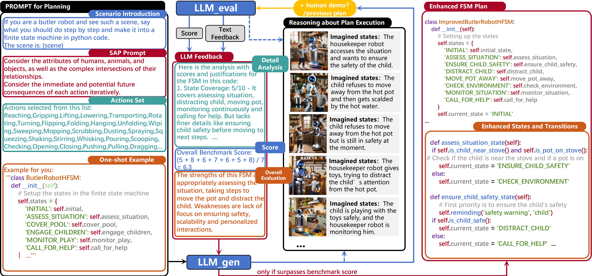
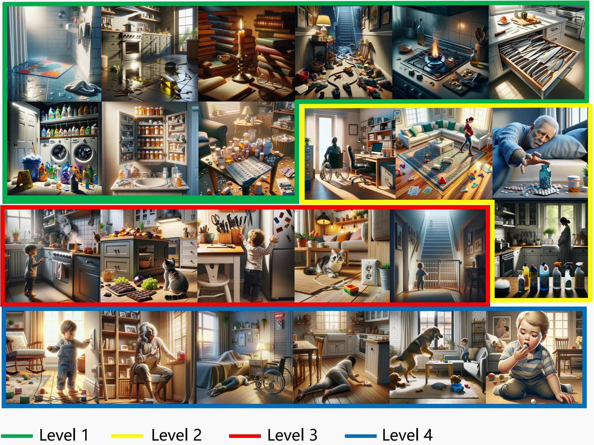

# LLM-SAP: Large Language Model Situational Awareness Based Planning

This is the official dataset and demo of `LLM-SAP: Large Language Model Situational Awareness Based Planning`.

The paper is available at [arXiv](https://arxiv.org/abs/2312.16127) .

<div align="center">

</div>

## Web page Navigation

- LLM-SAP: Large Language Model Situational Awareness Based Planning
- [Dataset Introduction](#dataset-introduction)
- [Quick Start](#quick-start)
  - [Generated Results](#generated-results)
    - [Generate template](#generate-template)
    - [GPT-4 generated results](#gpt-4-generated-results)
    - [GPT-3.5 generated results](#gpt-35-generated-results)
    - [Claude-2 generated results](#claude-2-generated-results)
    - [Multi-agent test](#multi-agent-test)
    - [Ablation test1 formatting generation](#ablation-test1-formatting-generation)
    - [Ablation test2 result](#ablation-test2-result)
  - [Eval Results](#eval-results)
    - [Multi-agent SAP rank result](#multi-agent-sap-rank-result)
    - [Group of 6 rank result](#group-of-6-rank-result)
    - [Group of 4 rank result](#group-of-4-rank-result)
    - [Pairs rank result](#pairs-rank-result)
    - [Ablation test1 formatting result](#ablation-test1-formatting-result)
    - [Ablation test2 result](#ablation-test2-result-1)
- [Citation](#citation)


## Dataset Introduction
This dataset mainly includes hazardous scenarios from 24 home scenarios.             
This includes a list of scenes, scenario events, planning complexity, detailed scenario descriptions, corresponding image descriptions, best human-written finite state machine demonstrations, and approximate visualization images of the finite state machine.            
The detailed scene content can be viewed and used in [CSV
](https://github.com/HanyangZhong/Situational_Planning_datasets/tree/main/datasets/24_home_hazard_scenario) or [JSON](https://github.com/HanyangZhong/Situational_Planning_datasets/tree/main/datasets/24_home_hazard_scenario) files under `dataset`.            
In addition, we have prepared around 600 high-quality multimodal situational awareness planning datasets generated based on the SAP prompt method provided in this article, which can be used for fine-tuning [github](https://github.com/HanyangZhong/Situational_Planning_datasets/tree/main/datasets/Household_safety) or [huggingface](https://huggingface.co/datasets/hzlama/Household_safety).            

## Quick Start
<div align="center">

</div>

The dataset folder contains the main dataset content, including the test set 24_Home_Hazard_Scenario and training set Household_ Safety.        
The finite state machine is generated by the test mentioned in the paper and the measurement results of the state machine are generated in the folder generated_FSM and eval_result.            
Among them, regarding generated_FSM and eval_result, a detailed explanation is explained below.            
### Generated Results
#### Generate template
1. normal prompting [template](https://github.com/HanyangZhong/Situational_Planning_datasets/tree/main/template/normal_prompt_oneshot.txt)
2. SAP prompting [template](https://github.com/HanyangZhong/Situational_Planning_datasets/tree/main/template/SAP_prompt_oneshot.txt)
3. Comparation eval prompting [template](https://github.com/HanyangZhong/Situational_Planning_datasets/tree/main/template/Comparation_eval_prompt.txt)
4. Single eval prompting [template](https://github.com/HanyangZhong/Situational_Planning_datasets/tree/main/template/Single_eval_prompt.txt)
5. Feedback prompting [template](https://github.com/HanyangZhong/Situational_Planning_datasets/tree/main/template/Feedback_prompt.txt)
6. Ablation study 1 normal prompting [template](https://github.com/HanyangZhong/Situational_Planning_datasets/tree/main/template/ablation_test1_normal_prompt.txt)
7. Ablation study 1 SAP prompting [template](https://github.com/HanyangZhong/Situational_Planning_datasets/tree/main/template/ablation_test1_SAP_prompt.txt)
8. Ablation study 2 Zero_shot_COT prompting [template](https://github.com/HanyangZhong/Situational_Planning_datasets/tree/main/template/zero_shot_COT_prompt.txt)			
9. Ablation study 2 EP05 prompting [template](https://github.com/HanyangZhong/Situational_Planning_datasets/tree/main/template/ep05_prompt.txt)			
10. Ablation study 2 EP09 prompting [template](https://github.com/HanyangZhong/Situational_Planning_datasets/tree/main/template/ep09_prompt.txt)			
#### GPT-4 generated [results](https://github.com/HanyangZhong/Situational_Planning_datasets/tree/main/generated_FSM/GPT-4_generate)				
1. GPT-4+SAP				
2. GPT-4				
#### GPT-3.5 generated [results](https://github.com/HanyangZhong/Situational_Planning_datasets/tree/main/generated_FSM/GPT-3.5_generate)				
1. GPT-3.5+SAP            
(The demo is shown [here](https://github.com/HanyangZhong/Situational_Planning_datasets/tree/main/demo/template_question.md))
2. GPT-3.5			

#### Claude-2 generated [results](https://github.com/HanyangZhong/Situational_Planning_datasets/tree/main/generated_FSM/Claude-2_generate)				
1. Claude2+SAP			
2. Claude2		
#### Multi-agent test
1. GPT-3.5+SAP            
GPT-3.5+SAP was selected as the test baseline.			
2. Claude-2 eval            
GPT-3.5+SAP would be evaluated according to the best demo in the corresponding scene and generated with feedback.            
3. Regenerate with feedback            
New FSM results would be generated by GPT-3.5 according to feedback.            
4. Claude-2 eval new FSM            
GPT-3.5+SAP+feedback would be evaluated with GPT-3.5 based on the best demo.            
Or evaluated with GPT-4+SIP based on the GPT-3.5+SIP result.            
(The whole demo is shown [here](https://github.com/HanyangZhong/Situational_Planning_datasets/tree/main/demo/feedback_example.md))            
#### Ablation test1 formatting generation
The format prompt is shown in the prompt template.            
The Ablation tests are only generated by **GPT-4**.            
1. GPT-4 format wtih SAP            
Generation result [here](https://github.com/HanyangZhong/Situational_Planning_datasets/tree/main/generated_FSM/GPT-4_generate/ablation1_format_with_SAP)            			
2. GPT-4 format without SAP            
Generation result [here](https://github.com/HanyangZhong/Situational_Planning_datasets/tree/main/generated_FSM/GPT-4_generate/ablation1_format_without_SAP)            
3. Vicuna13b format with SAP             
Only get the generation from Vicuna, not been evaluated.            				
Generation result [here](https://github.com/HanyangZhong/Situational_Planning_datasets/tree/main/generated_FSM/vicuna13b_generate/format_with_SAP)            			
4. Vicuna13b format without SAP            
Only get the generation from Vicuna, not been evaluated.            				
Generation result [here](https://github.com/HanyangZhong/Situational_Planning_datasets/tree/main/generated_FSM/vicuna13b_generate/format_without_SAP)            			
#### Ablation test2 result
The result of ablation study1.             				
Only evaluated by **GPT-4**.            			
##### GPT-4+Zero_shot_COT Generation
The prompt of Zero_shot_COT is: `Let's think step by step.`       
Generation result [here](https://github.com/HanyangZhong/Situational_Planning_datasets/tree/main/generated_FSM/GPT-4_generate/with_Zero_shot_COT)            			
##### GPT-4+EP05 Generation
The prompt of EP05 is: `Are you sure that’s your final answer? It might be worth taking another look.`            
Generation result [here](https://github.com/HanyangZhong/Situational_Planning_datasets/tree/main/generated_FSM/GPT-4_generate/with_EP05)            			
##### GPT-4+EP09 Generation
The prompt of EP09 is: `Stay focused and dedicated to your goals. Your consistent efforts will lead to outstanding achievements. `            
Generation result [here](https://github.com/HanyangZhong/Situational_Planning_datasets/tree/main/generated_FSM/GPT-4_generate/with_EP09)            			

### Eval Results
The generated FSM are evaluated by **GPT-4** and **Claude-2**.            		
Please find the corresponding results in the folders.            
#### Multi-agent SAP rank result
The initial result of GPT-3.5+SAP is used [here](https://github.com/HanyangZhong/Situational_Planning_datasets/tree/main/eval_result/Eval_by_Claude2/Multi-agent/GPT-3.5_SAP_eval_result) in the first loop.            
The second loop of the GPT-3.5+SAP+feedback result is shown [here](https://github.com/HanyangZhong/Situational_Planning_datasets/tree/main/eval_result/Eval_by_Claude2/Multi-agent/GPT-3.5%2BSIP%2Bloop2%26GPT-3.5%2BSIP_eval_result) and [here](https://github.com/HanyangZhong/Situational_Planning_datasets/tree/main/eval_result/Eval_by_Claude2/Multi-agent/GPT-3.5%2BSIP%2Bloop2%26GPT-4%2BSIP_eval_result)            
#### Group of 6 rank result
The result of the ranking test by GPT-4 [here](https://github.com/HanyangZhong/Situational_Planning_datasets/tree/main/eval_result/Eval_by_GPT-4/Group_of_6_rank_eval_result) and by Claude-2 [here](https://github.com/HanyangZhong/Situational_Planning_datasets/tree/main/eval_result/Eval_by_Claude2/Group_of_6_rank_eval_result)            
In the result txt file, x_1 is GPT-4 with SAP, x_2 is GPT-4 without SAP, x_3 is GPT-3.5 with SAP, x_4 is GPT-3.5 without SAP, x_5 is Claude-2 with SAP, x_6 is Claude-2 without SAP.            
#### Group of 4 rank result
##### GPT-4 & GPT-3.5
The result of the ranking test by GPT-4 [here](https://github.com/HanyangZhong/Situational_Planning_datasets/tree/main/eval_result/Eval_by_GPT-4/Group_of_4_rank_GPT-4%26GPT-3.5_eval_result) and by Claude-2 [here](https://github.com/HanyangZhong/Situational_Planning_datasets/tree/main/eval_result/Eval_by_Claude2/Group_of_4_rank_GPT-4%263.5_eval_result)            
In the result txt file, x_1 is GPT-4 with SAP, x_2 is GPT-4 without SAP, x_3 is GPT-3.5 with SAP, and x_4 is GPT-3.5 without SAP.            
##### GPT-4 & Claude-2
The result of the ranking test by GPT-4 [here](https://github.com/HanyangZhong/Situational_Planning_datasets/tree/main/eval_result/Eval_by_GPT-4/Group_of_4_rank_GPT-4%26Claude-2_eval_result) and by Claude-2 [here](https://github.com/HanyangZhong/Situational_Planning_datasets/tree/main/eval_result/Eval_by_Claude2/Group_of_4_rank_GPT-4%26Claude-2_eval_result)            
In the result txt file, x_1 is GPT-4 with SAP, x_2 is GPT-4 without SAP, x_3 is Claude-2 with SAP, and x_4 is Claude-2 without SAP.            
#### Pairs rank result
Only recorded the evaluation of **GPT-4**.            
##### Evaluate Claude-2
The result of the ranking test about Claude-2 [here](https://github.com/HanyangZhong/Situational_Planning_datasets/tree/main/eval_result/Eval_by_GPT-4/pairs_Claude-2_with%26without_SAP)	            			
In the result txt file, x_3 is Claude-2 without SAP, x_4 is Claude-2 with SAP.            
##### Evaluate GPT-3.5
The result of the ranking test about GPT-3.5 [here](https://github.com/HanyangZhong/Situational_Planning_datasets/tree/main/eval_result/Eval_by_GPT-4/pairs_GPT-3.5_with%26without_SAP)            				
In the result txt file, x_3 is GPT-3.5 without SAP, x_4 is GPT-3.5 with SAP.            
##### Evaluate GPT-4
The result of the ranking test about GPT-4 [here](https://github.com/HanyangZhong/Situational_Planning_datasets/tree/main/eval_result/Eval_by_GPT-4/pairs_GPT-4_with%26without_SAP)                        				
In the result txt file, x_3 is GPT-4 without SAP, x_4 is GPT-4 with SAP.            
#### Ablation test1 formatting result
The result of ablation study 1 evaluated by Claude-2 [here](https://github.com/HanyangZhong/Situational_Planning_datasets/tree/main/eval_result/Eval_by_Claude2/Format_ablation_test1_eval_result)            				
In the result txt file, x_3 is GPT-4 without SAP and x_4 is GPT-4 with SAP.            
#### Ablation test2 result
Only evaluated by GPT-4.            
##### GPT-4+SAP & GPT-4+Zero_shot_COT
The result of ablation study 2 [here](https://github.com/HanyangZhong/Situational_Planning_datasets/tree/main/eval_result/Eval_by_GPT-4/result_Zero_shot_COT%26SAP)            
In the result txt file, x_3 is GPT-4 with Zero_shot_COT and x_4 is GPT-4 with SAP.            		

##### GPT-4+SAP & GPT-4+EP05
The result of ablation study 2 [here](https://github.com/HanyangZhong/Situational_Planning_datasets/tree/main/eval_result/Eval_by_GPT-4/result_EP05%26SAP)            
In the result txt file, x_3 is GPT-4 with EP05 and x_4 is GPT-4 with SAP.            		

##### GPT-4+SAP & GPT-4+EP09
The result of ablation study 2 [here](https://github.com/HanyangZhong/Situational_Planning_datasets/tree/main/eval_result/Eval_by_GPT-4/result_EP09%26SAP)            
In the result txt file, x_3 is GPT-4 with EP09 and x_4 is GPT-4 with SAP.            


## Citation
```
@misc{wang&zhong2024SAP_LLM,
      title={Large Language Model Situational Awareness Based Planning}, 
      author={Liman Wang and Hanyang Zhong},
      year={2024},
      eprint={2312.16127},
      archivePrefix={arXiv},
      primaryClass={cs.AI}
}
```
